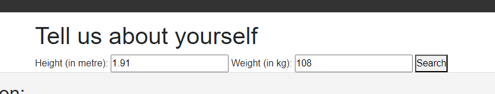

# cariLOL

## A program that allows the user to enter culinary keywords and obtain fun, exotic and random recipes from around the world! On the other hand, it also allows users to get their BMI.

This project was carried out to create 2 apps, linked in one website:

1) An app that allows the user to enter a few keywords and obtain detailed recipes on how to prepare those meals. The app allows the user to determine the portion size (by weight) of a given food/group of foods and to get the basic nutritional value for it/them. At the same time, the app produces 3 ramdom recipes where the ingredients entered by the user are prevalent. These recipes are presented as images and links for the detailed instructions for the preparation of the meals.

2) An app that takes the user's basic physiological details and returns their BMI.

## Installation

To use this webpage, the user must have access to the internet. Enter, in the search bar, the address "https://rhipsime.github.io/cariLOL/index.html" and press Enter.

## Usage

To use the webpage:

1) FoodCheck:

1 - Navigate to it and note the elements on the page. At the top left there is the page title. At the top right of the page, there are links that can be clicked to reach the functional pages. There are also image links that can take the user to the functional pages.

;

;

2 - Navigate to it and note the elements on the page. At the top left there is the page title. At the center of the page, there are input boxes, where the user will enter their choice.

;

3 - If the user clicks on the search button without having entered any criteria in the input boxes, a modal prompt will issue warning and instructind the user about next steps.

;

4 - The user must enter one or more ingredients. The user is not mandated to enter the amount or units of weight and; in the case they don't, the results will be for 100 grams.

;

5 - The user has the option to enter data in the additional fields.

;

6 - The page returns the nutritional data and 3 random recipes with links to the detailed recipes.

;

7 - When the user clicks on the name of the recipe, they are taken to another page, where they can get detailed information about how to prepare the meal.

;

2) BMI:

1 - The user enters their height in meters and weight inn kilograms.

;

1 - The user receives their current BMI category.

;

## Credits

This app was produced for the purpose of fulfilling cousework assignment in relation to the EdEx Web Develpment bootcamp (https://skillsforlife.edx.org/enroll/ui/signIn). The team members Kamila Wroblewska, Arie David, Ioan Diaconu and Antimio Casimiro. 

## License

MIT License

Copyright (c) [2024] [Kamila Wroblewska, Arie David, Ioan Diaconu and Antimio Casimiro]

Permission is hereby granted, free of charge, to any person obtaining a copy
of this software and associated documentation files (the "Software"), to deal
in the Software without restriction, including without limitation the rights
to use, copy, modify, merge, publish, distribute, sublicense, and/or sell
copies of the Software, and to permit persons to whom the Software is
furnished to do so, subject to the following conditions:

The above copyright notice and this permission notice shall be included in all
copies or substantial portions of the Software.

THE SOFTWARE IS PROVIDED "AS IS", WITHOUT WARRANTY OF ANY KIND, EXPRESS OR
IMPLIED, INCLUDING BUT NOT LIMITED TO THE WARRANTIES OF MERCHANTABILITY,
FITNESS FOR A PARTICULAR PURPOSE AND NONINFRINGEMENT. IN NO EVENT SHALL THE
AUTHORS OR COPYRIGHT HOLDERS BE LIABLE FOR ANY CLAIM, DAMAGES OR OTHER
LIABILITY, WHETHER IN AN ACTION OF CONTRACT, TORT OR OTHERWISE, ARISING FROM,
OUT OF OR IN CONNECTION WITH THE SOFTWARE OR THE USE OR OTHER DEALINGS IN THE
SOFTWARE.